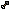
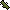
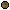
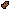
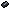

# ID Change Log

- Run at: 2026-11-19T16:01:16.115Z
- Bundle: https://bloxd.io/static/js/ad2avs.main.90d9e4dd.js
- Entries: 10081 -> 10091

ID changed (1532)

-  Wood Pickaxe: 8549 -> **8559**
-  Stone Pickaxe: 8550 -> **8560**
-  Iron Pickaxe: 8551 -> **8561**
-  Gold Pickaxe: 8552 -> **8562**
-  Diamond Pickaxe: 8553 -> **8563**
-  Moonstone Pickaxe: 8554 -> **8564**
-  Golem Pickaxe: 8555 -> **8565**
-  Wood Axe: 8556 -> **8566**
-  Stone Axe: 8557 -> **8567**
-  Iron Axe: 8558 -> **8568**
-  Gold Axe: 8559 -> **8569**
-  Diamond Axe: 8560 -> **8570**
-  Moonstone Axe: 8561 -> **8571**
-  Artisan Axe: 8562 -> **8572**
-  Wood Spade: 8563 -> **8573**
-  Stone Spade: 8564 -> **8574**
-  Iron Spade: 8565 -> **8575**
-  Gold Spade: 8566 -> **8576**
-  Diamond Spade: 8567 -> **8577**
-  Wood Sword: 8568 -> **8578**
-  Stone Sword: 8569 -> **8579**
-  Iron Sword: 8570 -> **8580**
-  Gold Sword: 8571 -> **8581**
-  Diamond Sword: 8572 -> **8582**
-  Knight Sword: 8573 -> **8583**
-  Wood Hoe: 8574 -> **8584**
-  Stone Hoe: 8575 -> **8585**
-  Iron Hoe: 8576 -> **8586**
-  Gold Hoe: 8577 -> **8587**
-  Diamond Hoe: 8578 -> **8588**
-  Flashlight: 8579 -> **8589**
-  Mining Helmet: 8580 -> **8590**
-  Wood Helmet: 8581 -> **8591**
-  Iron Helmet: 8582 -> **8592**
-  Gold Helmet: 8583 -> **8593**
-  Diamond Helmet: 8584 -> **8594**
-  Wood Chestplate: 8585 -> **8595**
-  Iron Chestplate: 8586 -> **8596**
-  Gold Chestplate: 8587 -> **8597**
-  Diamond Chestplate: 8588 -> **8598**
-  Fur Chestplate: 8589 -> **8599**
-  Wood Leggings: 8590 -> **8600**
-  Iron Leggings: 8591 -> **8601**
-  Gold Leggings: 8592 -> **8602**
-  Diamond Leggings: 8593 -> **8603**
-  Wood Boots: 8594 -> **8604**
-  Iron Boots: 8595 -> **8605**
-  Gold Boots: 8596 -> **8606**
-  Diamond Boots: 8597 -> **8607**
-  Spiked Boots: 8598 -> **8608**
-  Wood Gauntlets: 8599 -> **8609**
-  Iron Gauntlets: 8600 -> **8610**
-  Gold Gauntlets: 8601 -> **8611**
-  Diamond Gauntlets: 8602 -> **8612**
-  Military Helmet: 8603 -> **8613**
-  Military Chestplate: 8604 -> **8614**
-  Military Gauntlets: 8605 -> **8615**
-  Military Leggings: 8606 -> **8616**
-  Military Boots: 8607 -> **8617**
-  White Wood Helmet: 8608 -> **8618**
-  White Wood Chestplate: 8609 -> **8619**
-  White Wood Leggings: 8610 -> **8620**
-  White Wood Boots: 8611 -> **8621**
-  White Wood Gauntlets: 8612 -> **8622**
-  Orange Wood Helmet: 8613 -> **8623**
-  Orange Wood Chestplate: 8614 -> **8624**
-  Orange Wood Leggings: 8615 -> **8625**
-  Orange Wood Boots: 8616 -> **8626**
-  Orange Wood Gauntlets: 8617 -> **8627**
-  Magenta Wood Helmet: 8618 -> **8628**
-  Magenta Wood Chestplate: 8619 -> **8629**
-  Magenta Wood Leggings: 8620 -> **8630**
-  Magenta Wood Boots: 8621 -> **8631**
-  Magenta Wood Gauntlets: 8622 -> **8632**
-  Light Blue Wood Helmet: 8623 -> **8633**
-  Light Blue Wood Chestplate: 8624 -> **8634**
-  Light Blue Wood Leggings: 8625 -> **8635**
-  Light Blue Wood Boots: 8626 -> **8636**
-  Light Blue Wood Gauntlets: 8627 -> **8637**
-  Yellow Wood Helmet: 8628 -> **8638**
-  Yellow Wood Chestplate: 8629 -> **8639**
-  Yellow Wood Leggings: 8630 -> **8640**
-  Yellow Wood Boots: 8631 -> **8641**
-  Yellow Wood Gauntlets: 8632 -> **8642**
-  Lime Wood Helmet: 8633 -> **8643**
-  Lime Wood Chestplate: 8634 -> **8644**
-  Lime Wood Leggings: 8635 -> **8645**
-  Lime Wood Boots: 8636 -> **8646**
-  Lime Wood Gauntlets: 8637 -> **8647**
-  Pink Wood Helmet: 8638 -> **8648**
-  Pink Wood Chestplate: 8639 -> **8649**
-  Pink Wood Leggings: 8640 -> **8650**
-  Pink Wood Boots: 8641 -> **8651**
-  Pink Wood Gauntlets: 8642 -> **8652**
-  Gray Wood Helmet: 8643 -> **8653**
-  Gray Wood Chestplate: 8644 -> **8654**
-  Gray Wood Leggings: 8645 -> **8655**
-  Gray Wood Boots: 8646 -> **8656**
-  Gray Wood Gauntlets: 8647 -> **8657**
-  Light Gray Wood Helmet: 8648 -> **8658**
-  Light Gray Wood Chestplate: 8649 -> **8659**
-  Light Gray Wood Leggings: 8650 -> **8660**
-  Light Gray Wood Boots: 8651 -> **8661**
-  Light Gray Wood Gauntlets: 8652 -> **8662**
-  Cyan Wood Helmet: 8653 -> **8663**
-  Cyan Wood Chestplate: 8654 -> **8664**
-  Cyan Wood Leggings: 8655 -> **8665**
-  Cyan Wood Boots: 8656 -> **8666**
-  Cyan Wood Gauntlets: 8657 -> **8667**
-  Purple Wood Helmet: 8658 -> **8668**
-  Purple Wood Chestplate: 8659 -> **8669**
-  Purple Wood Leggings: 8660 -> **8670**
-  Purple Wood Boots: 8661 -> **8671**
-  Purple Wood Gauntlets: 8662 -> **8672**
-  Blue Wood Helmet: 8663 -> **8673**
-  Blue Wood Chestplate: 8664 -> **8674**
-  Blue Wood Leggings: 8665 -> **8675**
-  Blue Wood Boots: 8666 -> **8676**
-  Blue Wood Gauntlets: 8667 -> **8677**
-  Brown Wood Helmet: 8668 -> **8678**
-  Brown Wood Chestplate: 8669 -> **8679**
-  Brown Wood Leggings: 8670 -> **8680**
-  Brown Wood Boots: 8671 -> **8681**
-  Brown Wood Gauntlets: 8672 -> **8682**
-  Green Wood Helmet: 8673 -> **8683**
-  Green Wood Chestplate: 8674 -> **8684**
-  Green Wood Leggings: 8675 -> **8685**
-  Green Wood Boots: 8676 -> **8686**
-  Green Wood Gauntlets: 8677 -> **8687**
-  Red Wood Helmet: 8678 -> **8688**
-  Red Wood Chestplate: 8679 -> **8689**
-  Red Wood Leggings: 8680 -> **8690**
-  Red Wood Boots: 8681 -> **8691**
-  Red Wood Gauntlets: 8682 -> **8692**
-  Black Wood Helmet: 8683 -> **8693**
-  Black Wood Chestplate: 8684 -> **8694**
-  Black Wood Leggings: 8685 -> **8695**
-  Black Wood Boots: 8686 -> **8696**
-  Black Wood Gauntlets: 8687 -> **8697**
-  Shears: 8688 -> **8698**
-  Artisan Shears: 8689 -> **8699**
-  Stick: 8690 -> **8700**
-  Coal: 8691 -> **8701**
-  Raw Iron: 8692 -> **8702**
-  Iron Bar: 8693 -> **8703**
-  Iron Fragment: 8694 -> **8704**
-  Raw Gold: 8695 -> **8705**
-  Gold Bar: 8696 -> **8706**
-  Gold Fragment: 8697 -> **8707**
-  Diamond: 8698 -> **8708**
-  Diamond Fragment: 8699 -> **8709**
-  Moonstone: 8700 -> **8710**
-  Lunite: 8701 -> **8711**
-  Moonstone Fragment: 8702 -> **8712**
-  Bowl: 8703 -> **8713**
-  Partially Full Bowl of Cranberries: 8704 -> **8714**
-  Half Full Bowl of Cranberries: 8705 -> **8715**
-  Nearly Full Bowl of Cranberries: 8706 -> **8716**
-  Bowl of Cranberries: 8707 -> **8717**
-  Mushroom Soup: 8708 -> **8718**
-  Glowing Soup: 8709 -> **8719**
-  Night Vision Soup: 8710 -> **8720**
-  Cotton: 8711 -> **8721**
-  Gold Crop: 8712 -> **8722**
-  Bucket: 8713 -> **8723**
-  Water Bucket: 8714 -> **8724**
-  Lava Bucket: 8715 -> **8725**
-  Boat: 8716 -> **8726**
-  INTERNAL_MESH_Boat: 8717 -> **8727**
-  Obsidian Boat: 8718 -> **8728**
-  INTERNAL_MESH_Obsidian Boat: 8719 -> **8729**
-  Speedboat: 8720 -> **8730**
-  INTERNAL_MESH_Speedboat: 8721 -> **8731**
-  Wood Hang Glider: 8722 -> **8732**
-  INTERNAL_MESH_Wood Hang Glider: 8723 -> **8733**
-  Iron Hang Glider: 8724 -> **8734**
-  INTERNAL_MESH_Iron Hang Glider: 8725 -> **8735**
-  Gold Hang Glider: 8726 -> **8736**
-  INTERNAL_MESH_Gold Hang Glider: 8727 -> **8737**
-  Diamond Hang Glider: 8728 -> **8738**
-  INTERNAL_MESH_Diamond Hang Glider: 8729 -> **8739**
-  Hovercraft: 8730 -> **8740**
-  INTERNAL_MESH_Hovercraft: 8731 -> **8741**
-  Yellow Kart: 8732 -> **8742**
-  White Kart: 8733 -> **8743**
-  Red Kart: 8734 -> **8744**
-  Purple Kart: 8735 -> **8745**
-  Pink Kart: 8736 -> **8746**
-  Orange Kart: 8737 -> **8747**
-  Magenta Kart: 8738 -> **8748**
-  Lime Kart: 8739 -> **8749**
-  Light Gray Kart: 8740 -> **8750**
-  Light Blue Kart: 8741 -> **8751**
-  Green Kart: 8742 -> **8752**
-  Gray Kart: 8743 -> **8753**
-  Cyan Kart: 8744 -> **8754**
-  Brown Kart: 8745 -> **8755**
-  Blue Kart: 8746 -> **8756**
-  Black Kart: 8747 -> **8757**
-  INTERNAL_MESH_Yellow Kart: 8748 -> **8758**
-  INTERNAL_MESH_White Kart: 8749 -> **8759**
-  INTERNAL_MESH_Red Kart: 8750 -> **8760**
-  INTERNAL_MESH_Purple Kart: 8751 -> **8761**
-  INTERNAL_MESH_Pink Kart: 8752 -> **8762**
-  INTERNAL_MESH_Orange Kart: 8753 -> **8763**
-  INTERNAL_MESH_Magenta Kart: 8754 -> **8764**
-  INTERNAL_MESH_Lime Kart: 8755 -> **8765**
-  INTERNAL_MESH_Light Gray Kart: 8756 -> **8766**
-  INTERNAL_MESH_Light Blue Kart: 8757 -> **8767**
-  INTERNAL_MESH_Green Kart: 8758 -> **8768**
-  INTERNAL_MESH_Gray Kart: 8759 -> **8769**
-  INTERNAL_MESH_Cyan Kart: 8760 -> **8770**
-  INTERNAL_MESH_Brown Kart: 8761 -> **8771**
-  INTERNAL_MESH_Blue Kart: 8762 -> **8772**
-  INTERNAL_MESH_Black Kart: 8763 -> **8773**
-  Off Roader: 8764 -> **8774**
-  INTERNAL_MESH_Off Roader: 8765 -> **8775**
-  Gold Mining Drill: 8766 -> **8776**
-  Iron Mining Drill: 8767 -> **8777**
-  Diamond Mining Drill: 8768 -> **8778**
-  Moonstone Mining Drill: 8769 -> **8779**
-  Armored Car: 8770 -> **8780**
-  INTERNAL_MESH_Gold Mining Drill: 8771 -> **8781**
-  INTERNAL_MESH_Iron Mining Drill: 8772 -> **8782**
-  INTERNAL_MESH_Diamond Mining Drill: 8773 -> **8783**
-  INTERNAL_MESH_Moonstone Mining Drill: 8774 -> **8784**
-  INTERNAL_MESH_Armored Car: 8775 -> **8785**
-  Light Blue Car: 8776 -> **8786**
-  INTERNAL_MESH_Car: 8777 -> **8787**
-  Snowball: 8778 -> **8788**
-  Snowball Launcher: 8779 -> **8789**
-  Pebble: 8780 -> **8790**
-  Reinforced Pebble: 8781 -> **8791**
-  Bullet: 8782 -> **8792**
-  Ball: 8783 -> **8793**
-  Reinforced Ball: 8784 -> **8794**
-  Frag Grenade: 8785 -> **8795**
-  Mining Grenade: 8786 -> **8796**
-  Smoke Grenade: 8787 -> **8797**
-  Moonstone Orb: 8788 -> **8798**
-  Fireball: 8789 -> **8799**
-  Bouncy Bomb: 8790 -> **8800**
-  RPG: 8791 -> **8801**
-  Obby RPG: 8792 -> **8802**
-  Super RPG: 8793 -> **8803**
-  Grenade Launcher: 8794 -> **8804**
-  Iceball: 8795 -> **8805**
-  67 Base Projectile: 8796 -> **8806**
-  67 Boosted Projectile: 8797 -> **8807**
-  Capitano Grenade: 8798 -> **8808**
-  Scatter Pellet: 8799 -> **8809**
-  Wood Bow: 8800 -> **8810**
-  Wood Bow|meta|charging2: 8801 -> **8811**
-  Wood Bow|meta|charging3: 8802 -> **8812**
-  Wood Bow|meta|charging4: 8803 -> **8813**
-  Stone Bow: 8804 -> **8814**
-  Stone Bow|meta|charging2: 8805 -> **8815**
-  Stone Bow|meta|charging3: 8806 -> **8816**
-  Stone Bow|meta|charging4: 8807 -> **8817**
-  Iron Bow: 8808 -> **8818**
-  Iron Bow|meta|charging2: 8809 -> **8819**
-  Iron Bow|meta|charging3: 8810 -> **8820**
-  Iron Bow|meta|charging4: 8811 -> **8821**
-  Gold Bow: 8812 -> **8822**
-  Gold Bow|meta|charging2: 8813 -> **8823**
-  Gold Bow|meta|charging3: 8814 -> **8824**
-  Gold Bow|meta|charging4: 8815 -> **8825**
-  Diamond Bow: 8816 -> **8826**
-  Diamond Bow|meta|charging2: 8817 -> **8827**
-  Diamond Bow|meta|charging3: 8818 -> **8828**
-  Diamond Bow|meta|charging4: 8819 -> **8829**
-  Wood Crossbow: 8820 -> **8830**
-  Wood Crossbow|meta|charging2: 8821 -> **8831**
-  Wood Crossbow|meta|charging3: 8822 -> **8832**
-  Wood Crossbow|meta|charging4: 8823 -> **8833**
-  Stone Crossbow: 8824 -> **8834**
-  Stone Crossbow|meta|charging2: 8825 -> **8835**
-  Stone Crossbow|meta|charging3: 8826 -> **8836**
-  Stone Crossbow|meta|charging4: 8827 -> **8837**
-  Iron Crossbow: 8828 -> **8838**
-  Iron Crossbow|meta|charging2: 8829 -> **8839**
-  Iron Crossbow|meta|charging3: 8830 -> **8840**
-  Iron Crossbow|meta|charging4: 8831 -> **8841**
-  Gold Crossbow: 8832 -> **8842**
-  Gold Crossbow|meta|charging2: 8833 -> **8843**
-  Gold Crossbow|meta|charging3: 8834 -> **8844**
-  Gold Crossbow|meta|charging4: 8835 -> **8845**
-  Diamond Crossbow: 8836 -> **8846**
-  Diamond Crossbow|meta|charging2: 8837 -> **8847**
-  Diamond Crossbow|meta|charging3: 8838 -> **8848**
-  Diamond Crossbow|meta|charging4: 8839 -> **8849**
-  Wood Crossbow Charged: 8840 -> **8850**
-  Stone Crossbow Charged: 8841 -> **8851**
-  Iron Crossbow Charged: 8842 -> **8852**
-  Gold Crossbow Charged: 8843 -> **8853**
-  Diamond Crossbow Charged: 8844 -> **8854**
-  Arrow: 8845 -> **8855**
-  Compass: 8846 -> **8856**
-  Compass|meta|dir2: 8847 -> **8857**
-  Compass|meta|dir3: 8848 -> **8858**
-  Compass|meta|dir4: 8849 -> **8859**
-  Compass|meta|dir5: 8850 -> **8860**
-  Compass|meta|dir6: 8851 -> **8861**
-  Compass|meta|dir7: 8852 -> **8862**
-  Compass|meta|dir8: 8853 -> **8863**
-  Compass|meta|dir9: 8854 -> **8864**
-  Compass|meta|dir10: 8855 -> **8865**
-  Compass|meta|dir11: 8856 -> **8866**
-  Compass|meta|dir12: 8857 -> **8867**
-  Chunk Map: 8858 -> **8868**
-  Bread: 8859 -> **8869**
-  Bowl of Rice: 8860 -> **8870**
-  Apple: 8861 -> **8871**
-  Plum: 8862 -> **8872**
-  Coconut: 8863 -> **8873**
-  Cracked Coconut: 8864 -> **8874**
-  Pear: 8865 -> **8875**
-  Cherry: 8866 -> **8876**
-  Banana: 8867 -> **8877**
-  Watermelon Slice: 8868 -> **8878**
-  Gold Watermelon Slice: 8869 -> **8879**
-  Melon Slice: 8870 -> **8880**
-  Gold Melon Slice: 8871 -> **8881**
-  Pumpkin Pie: 8872 -> **8882**
-  Corn: 8873 -> **8883**
-  Cornbread: 8874 -> **8884**
-  Chili Pepper: 8875 -> **8885**
-  Mango: 8876 -> **8886**
-  Carrot: 8877 -> **8887**
-  Gold Carrot: 8878 -> **8888**
-  Raw Potato: 8879 -> **8889**
-  Baked Potato: 8880 -> **8890**
-  Beetroot: 8881 -> **8891**
-  Raw Porkchop: 8882 -> **8892**
-  Cooked Porkchop: 8883 -> **8893**
-  Raw Beef: 8884 -> **8894**
-  Steak: 8885 -> **8895**
-  Raw Mutton: 8886 -> **8896**
-  Cooked Mutton: 8887 -> **8897**
-  Raw Venison: 8888 -> **8898**
-  Cooked Venison: 8889 -> **8899**
-  Rotten Flesh: 8890 -> **8900**
-  Rotten Brain: 8891 -> **8901**
-  Bone: 8892 -> **8902**
-  Bone Meal: 8893 -> **8903**
-  Leather: 8894 -> **8904**
-  Saddle: 8895 -> **8905**
-  Spirit Saddle: 8896 -> **8906**
-  Fur: 8897 -> **8907**
-  Golem Eye: 8898 -> **8908**
-  Knight Heart: 8899 -> **8909**
-  Teleport Heart: 8900 -> **8910**
-  Frost Shard: 8901 -> **8911**
-  Molten Cog: 8902 -> **8912**
-  Choir Bell: 8903 -> **8913**
-  Siege Core: 8904 -> **8914**
-  Flywheel: 8905 -> **8915**
-  Radiant Spark: 8906 -> **8916**
-  Brood Sac: 8907 -> **8917**
-  Bandolier: 8908 -> **8918**
-  Name Tag: 8909 -> **8919**
-  Book: 8910 -> **8920**
-  Empty Bottle: 8911 -> **8921**
-  Water Bottle: 8912 -> **8922**
-  Slowness Potion: 8913 -> **8923**
-  Slowness Potion II: 8914 -> **8924**
-  Splash Slowness Potion: 8915 -> **8925**
-  Splash Slowness Potion II: 8916 -> **8926**
-  Arrow of Slowness: 8917 -> **8927**
-  Poison Potion: 8918 -> **8928**
-  Poison Potion II: 8919 -> **8929**
-  Splash Poison Potion: 8920 -> **8930**
-  Splash Poison Potion II: 8921 -> **8931**
-  Arrow of Poison: 8922 -> **8932**
-  Weakness Potion: 8923 -> **8933**
-  Weakness Potion II: 8924 -> **8934**
-  Splash Weakness Potion: 8925 -> **8935**
-  Splash Weakness Potion II: 8926 -> **8936**
-  Arrow of Weakness: 8927 -> **8937**
-  Instant Damage Potion: 8928 -> **8938**
-  Instant Damage Potion II: 8929 -> **8939**
-  Splash Instant Damage Potion: 8930 -> **8940**
-  Splash Instant Damage Potion II: 8931 -> **8941**
-  Arrow of Instant Damage: 8932 -> **8942**
-  Milk Potion: 8933 -> **8943**
-  Splash Milk Potion: 8934 -> **8944**
-  Arrow of Milk: 8935 -> **8945**
-  Speed Potion: 8936 -> **8946**
-  Speed Potion II: 8937 -> **8947**
-  Splash Speed Potion: 8938 -> **8948**
-  Splash Speed Potion II: 8939 -> **8949**
-  Arrow of Speed: 8940 -> **8950**
-  Defense Potion: 8941 -> **8951**
-  Defense Potion II: 8942 -> **8952**
-  Splash Defense Potion: 8943 -> **8953**
-  Splash Defense Potion II: 8944 -> **8954**
-  Arrow of Defense: 8945 -> **8955**
-  Strength Potion: 8946 -> **8956**
-  Strength Potion II: 8947 -> **8957**
-  Splash Strength Potion: 8948 -> **8958**
-  Splash Strength Potion II: 8949 -> **8959**
-  Arrow of Strength: 8950 -> **8960**
-  Invisibility Potion: 8951 -> **8961**
-  Splash Invisibility Potion: 8952 -> **8962**
-  Arrow of Invisibility: 8953 -> **8963**
-  Jump Potion: 8954 -> **8964**
-  Jump Potion II: 8955 -> **8965**
-  Splash Jump Potion: 8956 -> **8966**
-  Splash Jump Potion II: 8957 -> **8967**
-  Arrow of Jumping: 8958 -> **8968**
-  Knockback Potion: 8959 -> **8969**
-  Splash Knockback Potion: 8960 -> **8970**
-  Splash Knockback Potion II: 8961 -> **8971**
-  Arrow of Knockback: 8962 -> **8972**
-  Regeneration Potion: 8963 -> **8973**
-  Regeneration Potion II: 8964 -> **8974**
-  Splash Regeneration Potion: 8965 -> **8975**
-  Splash Regeneration Potion II: 8966 -> **8976**
-  Arrow of Regeneration: 8967 -> **8977**
-  Instant Healing Potion: 8968 -> **8978**
-  Instant Healing Potion II: 8969 -> **8979**
-  Splash Instant Healing Potion: 8970 -> **8980**
-  Splash Instant Healing Potion II: 8971 -> **8981**
-  Arrow of Instant Healing: 8972 -> **8982**
-  Haste Potion: 8973 -> **8983**
-  Haste Potion II: 8974 -> **8984**
-  Splash Haste Potion: 8975 -> **8985**
-  Splash Haste Potion II: 8976 -> **8986**
-  Arrow of Haste: 8977 -> **8987**
-  Shield Potion: 8978 -> **8988**
-  Shield Potion II: 8979 -> **8989**
-  Splash Shield Potion: 8980 -> **8990**
-  Splash Shield Potion II: 8981 -> **8991**
-  Arrow of Shield: 8982 -> **8992**
-  Double Jump Potion: 8983 -> **8993**
-  Splash Double Jump Potion: 8984 -> **8994**
-  Arrow of Double Jump: 8985 -> **8995**
-  Heat Resistance Potion: 8986 -> **8996**
-  Splash Heat Resistance Potion: 8987 -> **8997**
-  Arrow of Heat Resistance: 8988 -> **8998**
-  X-Ray Vision Potion: 8989 -> **8999**
-  Splash X-Ray Vision Potion: 8990 -> **9000**
-  Arrow of X-Ray Vision: 8991 -> **9001**
-  Mining Yield Potion: 8992 -> **9002**
-  Mining Yield Potion II: 8993 -> **9003**
-  Splash Mining Yield Potion: 8994 -> **9004**
-  Splash Mining Yield Potion II: 8995 -> **9005**
-  Arrow of Mining Yield: 8996 -> **9006**
-  Brain Rot Potion: 8997 -> **9007**
-  Splash Brain Rot Potion: 8998 -> **9008**
-  Arrow of Brain Rot: 8999 -> **9009**
-  Chaos Potion: 9000 -> **9010**
-  Teleportation Potion: 9001 -> **9011**
-  Ammo: 9002 -> **9012**
-  AK-47: 9003 -> **9013**
-  AK-47|RequiresAmmo: 9004 -> **9014**
-  M16: 9005 -> **9015**
-  M16|RequiresAmmo: 9006 -> **9016**
-  MP40: 9007 -> **9017**
-  MP40|RequiresAmmo: 9008 -> **9018**
-  TAR-21: 9009 -> **9019**
-  TAR-21|RequiresAmmo: 9010 -> **9020**
-  M1911: 9011 -> **9021**
-  M1911|RequiresAmmo: 9012 -> **9022**
-  One Shot Pistol: 9013 -> **9023**
-  One Shot Pistol|RequiresAmmo: 9014 -> **9024**
-  Double Barrel: 9015 -> **9025**
-  Double Barrel|RequiresAmmo: 9016 -> **9026**
-  AWP: 9017 -> **9027**
-  AWP|RequiresAmmo: 9018 -> **9028**
-  Deagle: 9019 -> **9029**
-  Deagle|RequiresAmmo: 9020 -> **9030**
-  Striker-12: 9021 -> **9031**
-  Striker-12|RequiresAmmo: 9022 -> **9032**
-  VSR: 9023 -> **9033**
-  VSR|RequiresAmmo: 9024 -> **9034**
-  DMR: 9025 -> **9035**
-  DMR|RequiresAmmo: 9026 -> **9036**
-  Minigun: 9027 -> **9037**
-  Minigun|RequiresAmmo: 9028 -> **9038**
-  FMR: 9029 -> **9039**
-  FMR|RequiresAmmo: 9030 -> **9040**
-  SKAR: 9031 -> **9041**
-  SKAR|RequiresAmmo: 9032 -> **9042**
-  Block-19: 9033 -> **9043**
-  Block-19|RequiresAmmo: 9034 -> **9044**
-  Mini Izu: 9035 -> **9045**
-  Mini Izu|RequiresAmmo: 9036 -> **9046**
-  GPMG: 9037 -> **9047**
-  GPMG|RequiresAmmo: 9038 -> **9048**
-  Gold Coin: 9039 -> **9049**
-  Updraft: 9040 -> **9050**
-  Snowdash: 9041 -> **9051**
-  Floor Creator: 9042 -> **9052**
-  Moonstone Remote Explosive: 9043 -> **9053**
-  Moonstone Remote: 9044 -> **9054**
-  Ice Bridge: 9045 -> **9055**
-  Maple Planks Bridge: 9046 -> **9056**
-  Messy Stone Bridge: 9047 -> **9057**
-  Yellow Balloon: 9048 -> **9058**
-  White Balloon: 9049 -> **9059**
-  Red Balloon: 9050 -> **9060**
-  Purple Balloon: 9051 -> **9061**
-  Pink Balloon: 9052 -> **9062**
-  Orange Balloon: 9053 -> **9063**
-  Magenta Balloon: 9054 -> **9064**
-  Lime Balloon: 9055 -> **9065**
-  Light Gray Balloon: 9056 -> **9066**
-  Light Blue Balloon: 9057 -> **9067**
-  Green Balloon: 9058 -> **9068**
-  Gray Balloon: 9059 -> **9069**
-  Cyan Balloon: 9060 -> **9070**
-  Brown Balloon: 9061 -> **9071**
-  Blue Balloon: 9062 -> **9072**
-  Black Balloon: 9063 -> **9073**
-  INTERNAL_MESH_Yellow Balloon: 9064 -> **9074**
-  INTERNAL_MESH_White Balloon: 9065 -> **9075**
-  INTERNAL_MESH_Red Balloon: 9066 -> **9076**
-  INTERNAL_MESH_Purple Balloon: 9067 -> **9077**
-  INTERNAL_MESH_Pink Balloon: 9068 -> **9078**
-  INTERNAL_MESH_Orange Balloon: 9069 -> **9079**
-  INTERNAL_MESH_Magenta Balloon: 9070 -> **9080**
-  INTERNAL_MESH_Lime Balloon: 9071 -> **9081**
-  INTERNAL_MESH_Light Gray Balloon: 9072 -> **9082**
-  INTERNAL_MESH_Light Blue Balloon: 9073 -> **9083**
-  INTERNAL_MESH_Green Balloon: 9074 -> **9084**
-  INTERNAL_MESH_Gray Balloon: 9075 -> **9085**
-  INTERNAL_MESH_Cyan Balloon: 9076 -> **9086**
-  INTERNAL_MESH_Brown Balloon: 9077 -> **9087**
-  INTERNAL_MESH_Blue Balloon: 9078 -> **9088**
-  INTERNAL_MESH_Black Balloon: 9079 -> **9089**
-  Yellow Popup Tower: 9080 -> **9090**
-  White Popup Tower: 9081 -> **9091**
-  Red Popup Tower: 9082 -> **9092**
-  Purple Popup Tower: 9083 -> **9093**
-  Pink Popup Tower: 9084 -> **9094**
-  Orange Popup Tower: 9085 -> **9095**
-  Magenta Popup Tower: 9086 -> **9096**
-  Lime Popup Tower: 9087 -> **9097**
-  Light Gray Popup Tower: 9088 -> **9098**
-  Light Blue Popup Tower: 9089 -> **9099**
-  Green Popup Tower: 9090 -> **9100**
-  Gray Popup Tower: 9091 -> **9101**
-  Cyan Popup Tower: 9092 -> **9102**
-  Brown Popup Tower: 9093 -> **9103**
-  Blue Popup Tower: 9094 -> **9104**
-  Black Popup Tower: 9095 -> **9105**
-  Yellow Paintball Gun: 9096 -> **9106**
-  White Paintball Gun: 9097 -> **9107**
-  Red Paintball Gun: 9098 -> **9108**
-  Purple Paintball Gun: 9099 -> **9109**
-  Pink Paintball Gun: 9100 -> **9110**
-  Orange Paintball Gun: 9101 -> **9111**
-  Magenta Paintball Gun: 9102 -> **9112**
-  Lime Paintball Gun: 9103 -> **9113**
-  Light Gray Paintball Gun: 9104 -> **9114**
-  Light Blue Paintball Gun: 9105 -> **9115**
-  Green Paintball Gun: 9106 -> **9116**
-  Gray Paintball Gun: 9107 -> **9117**
-  Cyan Paintball Gun: 9108 -> **9118**
-  Brown Paintball Gun: 9109 -> **9119**
-  Blue Paintball Gun: 9110 -> **9120**
-  Black Paintball Gun: 9111 -> **9121**
-  Yellow Paintball: 9112 -> **9122**
-  White Paintball: 9113 -> **9123**
-  Red Paintball: 9114 -> **9124**
-  Purple Paintball: 9115 -> **9125**
-  Pink Paintball: 9116 -> **9126**
-  Orange Paintball: 9117 -> **9127**
-  Magenta Paintball: 9118 -> **9128**
-  Lime Paintball: 9119 -> **9129**
-  Light Gray Paintball: 9120 -> **9130**
-  Light Blue Paintball: 9121 -> **9131**
-  Green Paintball: 9122 -> **9132**
-  Gray Paintball: 9123 -> **9133**
-  Cyan Paintball: 9124 -> **9134**
-  Brown Paintball: 9125 -> **9135**
-  Blue Paintball: 9126 -> **9136**
-  Black Paintball: 9127 -> **9137**
-  Yellow Heavy Paintball Gun: 9128 -> **9138**
-  White Heavy Paintball Gun: 9129 -> **9139**
-  Red Heavy Paintball Gun: 9130 -> **9140**
-  Purple Heavy Paintball Gun: 9131 -> **9141**
-  Pink Heavy Paintball Gun: 9132 -> **9142**
-  Orange Heavy Paintball Gun: 9133 -> **9143**
-  Magenta Heavy Paintball Gun: 9134 -> **9144**
-  Lime Heavy Paintball Gun: 9135 -> **9145**
-  Light Gray Heavy Paintball Gun: 9136 -> **9146**
-  Light Blue Heavy Paintball Gun: 9137 -> **9147**
-  Green Heavy Paintball Gun: 9138 -> **9148**
-  Gray Heavy Paintball Gun: 9139 -> **9149**
-  Cyan Heavy Paintball Gun: 9140 -> **9150**
-  Brown Heavy Paintball Gun: 9141 -> **9151**
-  Blue Heavy Paintball Gun: 9142 -> **9152**
-  Black Heavy Paintball Gun: 9143 -> **9153**
-  Yellow Paintball Explosive Item: 9144 -> **9154**
-  White Paintball Explosive Item: 9145 -> **9155**
-  Red Paintball Explosive Item: 9146 -> **9156**
-  Purple Paintball Explosive Item: 9147 -> **9157**
-  Pink Paintball Explosive Item: 9148 -> **9158**
-  Orange Paintball Explosive Item: 9149 -> **9159**
-  Magenta Paintball Explosive Item: 9150 -> **9160**
-  Lime Paintball Explosive Item: 9151 -> **9161**
-  Light Gray Paintball Explosive Item: 9152 -> **9162**
-  Light Blue Paintball Explosive Item: 9153 -> **9163**
-  Green Paintball Explosive Item: 9154 -> **9164**
-  Gray Paintball Explosive Item: 9155 -> **9165**
-  Cyan Paintball Explosive Item: 9156 -> **9166**
-  Brown Paintball Explosive Item: 9157 -> **9167**
-  Blue Paintball Explosive Item: 9158 -> **9168**
-  Black Paintball Explosive Item: 9159 -> **9169**
-  Yellow Sticky Paintball Explosive Item: 9160 -> **9170**
-  White Sticky Paintball Explosive Item: 9161 -> **9171**
-  Red Sticky Paintball Explosive Item: 9162 -> **9172**
-  Purple Sticky Paintball Explosive Item: 9163 -> **9173**
-  Pink Sticky Paintball Explosive Item: 9164 -> **9174**
-  Orange Sticky Paintball Explosive Item: 9165 -> **9175**
-  Magenta Sticky Paintball Explosive Item: 9166 -> **9176**
-  Lime Sticky Paintball Explosive Item: 9167 -> **9177**
-  Light Gray Sticky Paintball Explosive Item: 9168 -> **9178**
-  Light Blue Sticky Paintball Explosive Item: 9169 -> **9179**
-  Green Sticky Paintball Explosive Item: 9170 -> **9180**
-  Gray Sticky Paintball Explosive Item: 9171 -> **9181**
-  Cyan Sticky Paintball Explosive Item: 9172 -> **9182**
-  Brown Sticky Paintball Explosive Item: 9173 -> **9183**
-  Blue Sticky Paintball Explosive Item: 9174 -> **9184**
-  Black Sticky Paintball Explosive Item: 9175 -> **9185**
-  Yellow Seeking Paintball Explosive Item: 9176 -> **9186**
-  White Seeking Paintball Explosive Item: 9177 -> **9187**
-  Red Seeking Paintball Explosive Item: 9178 -> **9188**
-  Purple Seeking Paintball Explosive Item: 9179 -> **9189**
-  Pink Seeking Paintball Explosive Item: 9180 -> **9190**
-  Orange Seeking Paintball Explosive Item: 9181 -> **9191**
-  Magenta Seeking Paintball Explosive Item: 9182 -> **9192**
-  Lime Seeking Paintball Explosive Item: 9183 -> **9193**
-  Light Gray Seeking Paintball Explosive Item: 9184 -> **9194**
-  Light Blue Seeking Paintball Explosive Item: 9185 -> **9195**
-  Green Seeking Paintball Explosive Item: 9186 -> **9196**
-  Gray Seeking Paintball Explosive Item: 9187 -> **9197**
-  Cyan Seeking Paintball Explosive Item: 9188 -> **9198**
-  Brown Seeking Paintball Explosive Item: 9189 -> **9199**
-  Blue Seeking Paintball Explosive Item: 9190 -> **9200**
-  Black Seeking Paintball Explosive Item: 9191 -> **9201**
-  Yellow Quick Paintball Explosive Item: 9192 -> **9202**
-  White Quick Paintball Explosive Item: 9193 -> **9203**
-  Red Quick Paintball Explosive Item: 9194 -> **9204**
-  Purple Quick Paintball Explosive Item: 9195 -> **9205**
-  Pink Quick Paintball Explosive Item: 9196 -> **9206**
-  Orange Quick Paintball Explosive Item: 9197 -> **9207**
-  Magenta Quick Paintball Explosive Item: 9198 -> **9208**
-  Lime Quick Paintball Explosive Item: 9199 -> **9209**
-  Light Gray Quick Paintball Explosive Item: 9200 -> **9210**
-  Light Blue Quick Paintball Explosive Item: 9201 -> **9211**
-  Green Quick Paintball Explosive Item: 9202 -> **9212**
-  Gray Quick Paintball Explosive Item: 9203 -> **9213**
-  Cyan Quick Paintball Explosive Item: 9204 -> **9214**
-  Brown Quick Paintball Explosive Item: 9205 -> **9215**
-  Blue Quick Paintball Explosive Item: 9206 -> **9216**
-  Black Quick Paintball Explosive Item: 9207 -> **9217**
-  Yellow Paint Bow: 9208 -> **9218**
-  Yellow Paint Bow|meta|charging2: 9209 -> **9219**
-  Yellow Paint Bow|meta|charging3: 9210 -> **9220**
-  Yellow Paint Bow|meta|charging4: 9211 -> **9221**
-  White Paint Bow: 9212 -> **9222**
-  White Paint Bow|meta|charging2: 9213 -> **9223**
-  White Paint Bow|meta|charging3: 9214 -> **9224**
-  White Paint Bow|meta|charging4: 9215 -> **9225**
-  Red Paint Bow: 9216 -> **9226**
-  Red Paint Bow|meta|charging2: 9217 -> **9227**
-  Red Paint Bow|meta|charging3: 9218 -> **9228**
-  Red Paint Bow|meta|charging4: 9219 -> **9229**
-  Purple Paint Bow: 9220 -> **9230**
-  Purple Paint Bow|meta|charging2: 9221 -> **9231**
-  Purple Paint Bow|meta|charging3: 9222 -> **9232**
-  Purple Paint Bow|meta|charging4: 9223 -> **9233**
-  Pink Paint Bow: 9224 -> **9234**
-  Pink Paint Bow|meta|charging2: 9225 -> **9235**
-  Pink Paint Bow|meta|charging3: 9226 -> **9236**
-  Pink Paint Bow|meta|charging4: 9227 -> **9237**
-  Orange Paint Bow: 9228 -> **9238**
-  Orange Paint Bow|meta|charging2: 9229 -> **9239**
-  Orange Paint Bow|meta|charging3: 9230 -> **9240**
-  Orange Paint Bow|meta|charging4: 9231 -> **9241**
-  Magenta Paint Bow: 9232 -> **9242**
-  Magenta Paint Bow|meta|charging2: 9233 -> **9243**
-  Magenta Paint Bow|meta|charging3: 9234 -> **9244**
-  Magenta Paint Bow|meta|charging4: 9235 -> **9245**
-  Lime Paint Bow: 9236 -> **9246**
-  Lime Paint Bow|meta|charging2: 9237 -> **9247**
-  Lime Paint Bow|meta|charging3: 9238 -> **9248**
-  Lime Paint Bow|meta|charging4: 9239 -> **9249**
-  Light Gray Paint Bow: 9240 -> **9250**
-  Light Gray Paint Bow|meta|charging2: 9241 -> **9251**
-  Light Gray Paint Bow|meta|charging3: 9242 -> **9252**
-  Light Gray Paint Bow|meta|charging4: 9243 -> **9253**
-  Light Blue Paint Bow: 9244 -> **9254**
-  Light Blue Paint Bow|meta|charging2: 9245 -> **9255**
-  Light Blue Paint Bow|meta|charging3: 9246 -> **9256**
-  Light Blue Paint Bow|meta|charging4: 9247 -> **9257**
-  Green Paint Bow: 9248 -> **9258**
-  Green Paint Bow|meta|charging2: 9249 -> **9259**
-  Green Paint Bow|meta|charging3: 9250 -> **9260**
-  Green Paint Bow|meta|charging4: 9251 -> **9261**
-  Gray Paint Bow: 9252 -> **9262**
-  Gray Paint Bow|meta|charging2: 9253 -> **9263**
-  Gray Paint Bow|meta|charging3: 9254 -> **9264**
-  Gray Paint Bow|meta|charging4: 9255 -> **9265**
-  Cyan Paint Bow: 9256 -> **9266**
-  Cyan Paint Bow|meta|charging2: 9257 -> **9267**
-  Cyan Paint Bow|meta|charging3: 9258 -> **9268**
-  Cyan Paint Bow|meta|charging4: 9259 -> **9269**
-  Brown Paint Bow: 9260 -> **9270**
-  Brown Paint Bow|meta|charging2: 9261 -> **9271**
-  Brown Paint Bow|meta|charging3: 9262 -> **9272**
-  Brown Paint Bow|meta|charging4: 9263 -> **9273**
-  Blue Paint Bow: 9264 -> **9274**
-  Blue Paint Bow|meta|charging2: 9265 -> **9275**
-  Blue Paint Bow|meta|charging3: 9266 -> **9276**
-  Blue Paint Bow|meta|charging4: 9267 -> **9277**
-  Black Paint Bow: 9268 -> **9278**
-  Black Paint Bow|meta|charging2: 9269 -> **9279**
-  Black Paint Bow|meta|charging3: 9270 -> **9280**
-  Black Paint Bow|meta|charging4: 9271 -> **9281**
-  Pig Spawn Orb: 9272 -> **9282**
-  Cow Spawn Orb: 9273 -> **9283**
-  Sheep Spawn Orb: 9274 -> **9284**
-  Horse Spawn Orb: 9275 -> **9285**
-  Camel Spawn Orb: 9276 -> **9286**
-  Iron Goofy Golem Spawn Orb: 9277 -> **9287**
-  Gold Goofy Golem Spawn Orb: 9278 -> **9288**
-  Diamond Goofy Golem Spawn Orb: 9279 -> **9289**
-  Moonstone Goofy Golem Spawn Orb: 9280 -> **9290**
-  Deer Spawn Orb: 9281 -> **9291**
-  Slime Spawn Orb: 9282 -> **9292**
-  Wolf Spawn Orb: 9283 -> **9293**
-  Wildcat Spawn Orb: 9284 -> **9294**
-  Spirit Golem Spawn Orb: 9285 -> **9295**
-  Spirit Wolf Spawn Orb: 9286 -> **9296**
-  Spirit Bear Spawn Orb: 9287 -> **9297**
-  Spirit Stag Spawn Orb: 9288 -> **9298**
-  Spirit Gorilla Spawn Orb: 9289 -> **9299**
-  Bear Spawn Orb: 9290 -> **9300**
-  Stag Spawn Orb: 9291 -> **9301**
-  Gold Watermelon Stag Spawn Orb: 9292 -> **9302**
-  Gorilla Spawn Orb: 9293 -> **9303**
-  Cave Golem Spawn Orb: 9294 -> **9304**
-  Draugr Zombie Spawn Orb: 9295 -> **9305**
-  Draugr Skeleton Spawn Orb: 9296 -> **9306**
-  Frost Golem Spawn Orb: 9297 -> **9307**
-  Frost Zombie Spawn Orb: 9298 -> **9308**
-  Frost Skeleton Spawn Orb: 9299 -> **9309**
-  Draugr Knight Spawn Orb: 9300 -> **9310**
-  Draugr Huntress Spawn Orb: 9301 -> **9311**
-  Magma Golem Spawn Orb: 9302 -> **9312**
-  Draugr Warper Spawn Orb: 9303 -> **9313**
-  Frost Wraith Spawn Orb: 9304 -> **9314**
-  Draugr Reaver Spawn Orb: 9305 -> **9315**
-  Stalker Spawn Orb: 9306 -> **9316**
-  Crone Spawn Orb: 9307 -> **9317**
-  Iron Guardian Spawn Orb: 9308 -> **9318**
-  Gold Guardian Spawn Orb: 9309 -> **9319**
-  Diamond Guardian Spawn Orb: 9310 -> **9320**
-  Moonstone Guardian Spawn Orb: 9311 -> **9321**
-  Tiki Terror Spawn Orb: 9312 -> **9322**
-  Mob Catcher: 9313 -> **9323**
-  Caught Mob Pig Default: 9314 -> **9324**
-  Caught Mob Cow Default: 9315 -> **9325**
-  Caught Mob Cow Cream: 9316 -> **9326**
-  Caught Mob Sheep Default: 9317 -> **9327**
-  Caught Mob Sheep Black: 9318 -> **9328**
-  Caught Mob Sheep Red: 9319 -> **9329**
-  Caught Mob Sheep Orange: 9320 -> **9330**
-  Caught Mob Sheep Pink: 9321 -> **9331**
-  Caught Mob Sheep Purple: 9322 -> **9332**
-  Caught Mob Sheep Yellow: 9323 -> **9333**
-  Caught Mob Sheep Blue: 9324 -> **9334**
-  Caught Mob Sheep Brown: 9325 -> **9335**
-  Caught Mob Sheep Cyan: 9326 -> **9336**
-  Caught Mob Sheep Gray: 9327 -> **9337**
-  Caught Mob Sheep Green: 9328 -> **9338**
-  Caught Mob Sheep Lightblue: 9329 -> **9339**
-  Caught Mob Sheep Lightgray: 9330 -> **9340**
-  Caught Mob Sheep Lime: 9331 -> **9341**
-  Caught Mob Sheep Magenta: 9332 -> **9342**
-  Caught Mob Horse Default: 9333 -> **9343**
-  Caught Mob Horse Black: 9334 -> **9344**
-  Caught Mob Horse Brown: 9335 -> **9345**
-  Caught Mob Horse Cream: 9336 -> **9346**
-  Caught Mob Camel Default: 9337 -> **9347**
-  Caught Mob Camel Brown: 9338 -> **9348**
-  Caught Mob Iron_Goofy_Golem Default: 9339 -> **9349**
-  Caught Mob Iron_Goofy_Golem Flaking: 9340 -> **9350**
-  Caught Mob Iron_Goofy_Golem Patchy: 9341 -> **9351**
-  Caught Mob Iron_Goofy_Golem Shedding: 9342 -> **9352**
-  Caught Mob Iron_Goofy_Golem Bare: 9343 -> **9353**
-  Caught Mob Iron_Goofy_Golem Stone: 9344 -> **9354**
-  Caught Mob Gold_Goofy_Golem Default: 9345 -> **9355**
-  Caught Mob Gold_Goofy_Golem Flaking: 9346 -> **9356**
-  Caught Mob Gold_Goofy_Golem Patchy: 9347 -> **9357**
-  Caught Mob Gold_Goofy_Golem Shedding: 9348 -> **9358**
-  Caught Mob Gold_Goofy_Golem Bare: 9349 -> **9359**
-  Caught Mob Gold_Goofy_Golem Stone: 9350 -> **9360**
-  Caught Mob Diamond_Goofy_Golem Default: 9351 -> **9361**
-  Caught Mob Diamond_Goofy_Golem Flaking: 9352 -> **9362**
-  Caught Mob Diamond_Goofy_Golem Patchy: 9353 -> **9363**
-  Caught Mob Diamond_Goofy_Golem Shedding: 9354 -> **9364**
-  Caught Mob Diamond_Goofy_Golem Bare: 9355 -> **9365**
-  Caught Mob Diamond_Goofy_Golem Stone: 9356 -> **9366**
-  Caught Mob Moonstone_Goofy_Golem Default: 9357 -> **9367**
-  Caught Mob Moonstone_Goofy_Golem Flaking: 9358 -> **9368**
-  Caught Mob Moonstone_Goofy_Golem Patchy: 9359 -> **9369**
-  Caught Mob Moonstone_Goofy_Golem Shedding: 9360 -> **9370**
-  Caught Mob Moonstone_Goofy_Golem Bare: 9361 -> **9371**
-  Caught Mob Moonstone_Goofy_Golem Stone: 9362 -> **9372**
-  Caught Mob Deer Default: 9363 -> **9373**
-  Caught Mob Slime Default: 9364 -> **9374**
-  Caught Mob Wolf Default: 9365 -> **9375**
-  Caught Mob Wolf White: 9366 -> **9376**
-  Caught Mob Wolf Brown: 9367 -> **9377**
-  Caught Mob Wolf Grey: 9368 -> **9378**
-  Caught Mob Wolf Spectral: 9369 -> **9379**
-  Caught Mob Wildcat Default: 9370 -> **9380**
-  Caught Mob Wildcat Tabby: 9371 -> **9381**
-  Caught Mob Wildcat Grey: 9372 -> **9382**
-  Caught Mob Wildcat Black: 9373 -> **9383**
-  Caught Mob Wildcat Calico: 9374 -> **9384**
-  Caught Mob Wildcat Siamese: 9375 -> **9385**
-  Caught Mob Wildcat Leopard: 9376 -> **9386**
-  Caught Mob Spirit_Golem Default: 9377 -> **9387**
-  Caught Mob Spirit_Wolf Default: 9378 -> **9388**
-  Caught Mob Spirit_Bear Default: 9379 -> **9389**
-  Caught Mob Spirit_Stag Default: 9380 -> **9390**
-  Caught Mob Spirit_Gorilla Default: 9381 -> **9391**
-  Caught Mob Bear Default: 9382 -> **9392**
-  Caught Mob Stag Default: 9383 -> **9393**
-  Caught Mob Gold_Watermelon_Stag Default: 9384 -> **9394**
-  Caught Mob Gorilla Default: 9385 -> **9395**
-  Caught Mob Cave_Golem Default: 9386 -> **9396**
-  Caught Mob Cave_Golem Iron: 9387 -> **9397**
-  Caught Mob Cave_Golem Corrupted: 9388 -> **9398**
-  Caught Mob Draugr_Zombie Default: 9389 -> **9399**
-  Caught Mob Draugr_Zombie Longhairchestplate: 9390 -> **9400**
-  Caught Mob Draugr_Zombie Longhairclothed: 9391 -> **9401**
-  Caught Mob Draugr_Zombie Shorthairclothed: 9392 -> **9402**
-  Caught Mob Draugr_Zombie Flower: 9393 -> **9403**
-  Caught Mob Draugr_Zombie Flower2: 9394 -> **9404**
-  Caught Mob Draugr_Zombie Mushroom: 9395 -> **9405**
-  Caught Mob Draugr_Zombie Vine: 9396 -> **9406**
-  Caught Mob Draugr_Zombie Vine2: 9397 -> **9407**
-  Caught Mob Draugr_Zombie Corrupted: 9398 -> **9408**
-  Caught Mob Draugr_Zombie Corrupted2: 9399 -> **9409**
-  Caught Mob Draugr_Skeleton Default: 9400 -> **9410**
-  Caught Mob Frost_Golem Default: 9401 -> **9411**
-  Caught Mob Frost_Zombie Default: 9402 -> **9412**
-  Caught Mob Frost_Zombie Longhairchestplate: 9403 -> **9413**
-  Caught Mob Frost_Zombie Shorthairclothed: 9404 -> **9414**
-  Caught Mob Frost_Skeleton Default: 9405 -> **9415**
-  Caught Mob Draugr_Knight Default: 9406 -> **9416**
-  Caught Mob Draugr_Huntress Default: 9407 -> **9417**
-  Caught Mob Draugr_Huntress Chainmail: 9408 -> **9418**
-  Caught Mob Magma_Golem Default: 9409 -> **9419**
-  Caught Mob Draugr_Warper Default: 9410 -> **9420**
-  Caught Mob Frost_Wraith Default: 9411 -> **9421**
-  Caught Mob Frost_Wraith Tattered: 9412 -> **9422**
-  Caught Mob Frost_Wraith Frostking: 9413 -> **9423**
-  Caught Mob Frost_Wraith Accursed: 9414 -> **9424**
-  Caught Mob Draugr_Reaver Default: 9415 -> **9425**
-  Caught Mob Stalker Default: 9416 -> **9426**
-  Caught Mob Stalker Crimson: 9417 -> **9427**
-  Caught Mob Stalker Frost: 9418 -> **9428**
-  Caught Mob Stalker Void: 9419 -> **9429**
-  Caught Mob Crone Default: 9420 -> **9430**
-  Caught Mob Iron_Guardian Default: 9421 -> **9431**
-  Caught Mob Gold_Guardian Default: 9422 -> **9432**
-  Caught Mob Diamond_Guardian Default: 9423 -> **9433**
-  Caught Mob Moonstone_Guardian Default: 9424 -> **9434**
-  Caught Mob Tiki_Terror Default: 9425 -> **9435**
-  Caught Mob Tiki_Terror Titan: 9426 -> **9436**
-  Caught Mob Tiki_Terror Tormentor: 9427 -> **9437**
-  Caught Mob Tiki_Terror Tyrant: 9428 -> **9438**
- Caught Mob NPC Default: 9429 -> **9439**
- Caught Mob NPC Emma: 9430 -> **9440**
- Caught Mob NPC Leo: 9431 -> **9441**
- Caught Mob NPC Isabel: 9432 -> **9442**
- Caught Mob NPC Sanjay: 9433 -> **9443**
- Caught Mob NPC Imara: 9434 -> **9444**
- Caught Mob NPC Enoch: 9435 -> **9445**
- Caught Mob NPC Sara: 9436 -> **9446**
- Caught Mob NPC Carmen: 9437 -> **9447**
- Caught Mob NPC Chef: 9438 -> **9448**
-  Caught Mob 67 Default: 9439 -> **9449**
-  Caught Mob Bobino_Musculino Default: 9440 -> **9450**
-  Caught Mob Capitano_Explovissimo Default: 9441 -> **9451**
-  Caught Mob Desert_Fennec Default: 9442 -> **9452**
-  Caught Mob Armour_Collector Default: 9443 -> **9453**
-  Caught Mob Furnace_Knight Default: 9444 -> **9454**
-  Caught Mob Lil_Knight Default: 9445 -> **9455**
-  Caught Mob Glass_Gremlin Default: 9446 -> **9456**
-  Caught Mob Glass_Bro Default: 9447 -> **9457**
-  Caught Mob Lord_Vulcan Default: 9448 -> **9458**
-  Caught Mob Zombie Default: 9449 -> **9459**
-  Caught Mob Skeleton Default: 9450 -> **9460**
-  Caught Mob Mummy Default: 9451 -> **9461**
-  Caught Mob Scorpion Default: 9452 -> **9462**
-  Caught Mob Vulcanite Default: 9453 -> **9463**
-  Caught Mob Evil_Tome Default: 9454 -> **9464**
-  Caught Mob Magma_Toad Default: 9455 -> **9465**
-  Timed Spike Bomb: 9456 -> **9466**
-  Timed Spike Bomb|meta|charging2: 9457 -> **9467**
-  Timed Spike Bomb|meta|charging3: 9458 -> **9468**
-  Timed Spike Bomb|meta|charging4: 9459 -> **9469**
-  Toxin Ball: 9460 -> **9470**
-  Aura XP Fragment: 9461 -> **9471**
-  Aura XP Orb: 9462 -> **9472**
-  Aura XP Potion: 9463 -> **9473**
-  Aura XP Potion II: 9464 -> **9474**
-  Splash Aura XP Potion: 9465 -> **9475**
-  Splash Aura XP Potion II: 9466 -> **9476**
-  Arrow of Aura XP: 9467 -> **9477**
-  Firecracker: 9468 -> **9478**
-  Rainbow Firecracker: 9469 -> **9479**
-  Yellow Firecracker: 9470 -> **9480**
-  White Firecracker: 9471 -> **9481**
-  Red Firecracker: 9472 -> **9482**
-  Purple Firecracker: 9473 -> **9483**
-  Pink Firecracker: 9474 -> **9484**
-  Orange Firecracker: 9475 -> **9485**
-  Magenta Firecracker: 9476 -> **9486**
-  Lime Firecracker: 9477 -> **9487**
-  Light Gray Firecracker: 9478 -> **9488**
-  Light Blue Firecracker: 9479 -> **9489**
-  Green Firecracker: 9480 -> **9490**
-  Gray Firecracker: 9481 -> **9491**
-  Cyan Firecracker: 9482 -> **9492**
-  Brown Firecracker: 9483 -> **9493**
-  Blue Firecracker: 9484 -> **9494**
-  Black Firecracker: 9485 -> **9495**
-  Firecracker Pebble: 9486 -> **9496**
-  Rainbow Firecracker Pebble: 9487 -> **9497**
-  Yellow Firecracker Pebble: 9488 -> **9498**
-  White Firecracker Pebble: 9489 -> **9499**
-  Red Firecracker Pebble: 9490 -> **9500**
-  Purple Firecracker Pebble: 9491 -> **9501**
-  Pink Firecracker Pebble: 9492 -> **9502**
-  Orange Firecracker Pebble: 9493 -> **9503**
-  Magenta Firecracker Pebble: 9494 -> **9504**
-  Lime Firecracker Pebble: 9495 -> **9505**
-  Light Gray Firecracker Pebble: 9496 -> **9506**
-  Light Blue Firecracker Pebble: 9497 -> **9507**
-  Green Firecracker Pebble: 9498 -> **9508**
-  Gray Firecracker Pebble: 9499 -> **9509**
-  Cyan Firecracker Pebble: 9500 -> **9510**
-  Brown Firecracker Pebble: 9501 -> **9511**
-  Blue Firecracker Pebble: 9502 -> **9512**
-  Black Firecracker Pebble: 9503 -> **9513**
-  WorldBuilder Wand: 9504 -> **9514**
-  Red Strongfish: 9505 -> **9515**
-  Green Strongfish: 9506 -> **9516**
-  Moon Strongfish: 9507 -> **9517**
-  Wheatfish: 9508 -> **9518**
-  Moonfish: 9509 -> **9519**
-  Bombfish: 9510 -> **9520**
-  Boomerang Fish: 9511 -> **9521**
-  Root Flounder: 9512 -> **9522**
-  Abyss Carp: 9513 -> **9523**
-  Boulder Bass: 9514 -> **9524**
-  Barnaclejaw: 9515 -> **9525**
-  Crystalized Wheatfish: 9516 -> **9526**
-  Darter: 9517 -> **9527**
-  Shadow Darter: 9518 -> **9528**
-  Electric Eel: 9519 -> **9529**
-  Grass Snapper: 9520 -> **9530**
-  Jungle Spinefish: 9521 -> **9531**
-  Mangler Catfish: 9522 -> **9532**
-  Mossback Arapaima: 9523 -> **9533**
-  Sandbelly Piranha: 9524 -> **9534**
-  Shadeback Ray: 9525 -> **9535**
-  Mudbelly Tilapia: 9526 -> **9536**
-  Mireback Carp: 9527 -> **9537**
-  Rotslab Eel: 9528 -> **9538**
-  Aether Minnow: 9529 -> **9539**
-  Murkborne Ray: 9530 -> **9540**
-  Eldertide Leviathan: 9531 -> **9541**
-  Oarfish: 9532 -> **9542**
-  Alpha Moon Strongfish: 9533 -> **9543**
-  Bamboo Catfish: 9534 -> **9544**
-  Blackwater Bream: 9535 -> **9545**
-  Blackwater Leviathan: 9536 -> **9546**
-  Boned Sturgeon: 9537 -> **9547**
-  Bull Shark: 9538 -> **9548**
-  Channel Sawfish: 9539 -> **9549**
-  Coastal Mullet: 9540 -> **9550**
-  Coelacanth: 9541 -> **9551**
-  Driftwood Catfish: 9542 -> **9552**
-  Eagle Ray: 9543 -> **9553**
-  Giant Grouper: 9544 -> **9554**
-  Giant Moray: 9545 -> **9555**
-  Giant Stingray: 9546 -> **9556**
-  Golden Mahseer: 9547 -> **9557**
-  Greenfin Loach: 9548 -> **9558**
-  Mangrove Herring: 9549 -> **9559**
-  Moonlit Boomerang Fish: 9550 -> **9560**
-  Moonstone Pupfish: 9551 -> **9561**
-  Mudline Perch: 9552 -> **9562**
-  Murk Stingray: 9553 -> **9563**
-  Needlefish: 9554 -> **9564**
-  Nomai Moray: 9555 -> **9565**
-  Pearlescent Moonfish: 9556 -> **9566**
-  Rainbow Guppy: 9557 -> **9567**
-  Red Snapper: 9558 -> **9568**
-  Reedglass Minnow: 9559 -> **9569**
-  Reef Sardine: 9560 -> **9570**
-  Root Perch: 9561 -> **9571**
-  Rust Scad: 9562 -> **9572**
-  Seahorse: 9563 -> **9573**
-  Snakehead: 9564 -> **9574**
-  Spined Stickleback: 9565 -> **9575**
-  Stone Grouper: 9566 -> **9576**
-  Sumpback Carp: 9567 -> **9577**
-  Sunset Minnow: 9568 -> **9578**
-  Tarpon: 9569 -> **9579**
-  Threadfin Bream: 9570 -> **9580**
-  Tri-Pointed Needlefish: 9571 -> **9581**
-  Game Dev Fish: 9572 -> **9582**
-  Armoured Searobin: 9573 -> **9583**
-  Ash Lionfish: 9574 -> **9584**
-  Barefrost Toothfish: 9575 -> **9585**
-  Blackfin Icefish: 9576 -> **9586**
-  Basalt Pipefish: 9577 -> **9587**
-  Brimstone Spikefish: 9578 -> **9588**
-  Cinder Leviathan: 9579 -> **9589**
-  Crowned Flame Angelfish: 9580 -> **9590**
-  Deepwater Lanternfish: 9581 -> **9591**
-  Driftice Capelin: 9582 -> **9592**
-  Ember Chub: 9583 -> **9593**
-  Embermark Wrasse: 9584 -> **9594**
-  Eviota Vader: 9585 -> **9595**
-  Frost Herring: 9586 -> **9596**
-  Frost Wolf Eel: 9587 -> **9597**
-  Frostpaint Notie: 9588 -> **9598**
-  Frozen Grenadier: 9589 -> **9599**
-  Giant Trevally: 9590 -> **9600**
-  Glacial Lanternfish: 9591 -> **9601**
-  Glacial Silverfish: 9592 -> **9602**
-  Heatwarp Flounder: 9593 -> **9603**
-  Hatchetfish: 9594 -> **9604**
-  Ice Spined Notothenia: 9595 -> **9605**
-  Iceshelf Skate: 9596 -> **9606**
-  Icy Sculpin: 9597 -> **9607**
-  Lavaflow Trout: 9598 -> **9608**
-  Lavawake Slopefish: 9599 -> **9609**
-  Magma Sardinella: 9600 -> **9610**
-  Magma Trout: 9601 -> **9611**
-  Marbled Moray Cod: 9602 -> **9612**
-  Molten Lotella Cod: 9603 -> **9613**
-  Northern Wolffish: 9604 -> **9614**
-  Paleice Rockcod: 9605 -> **9615**
-  Permafrost Halibut: 9606 -> **9616**
-  Pithead: 9607 -> **9617**
-  Polarflash Electron: 9608 -> **9618**
-  Pyroclast Eel: 9609 -> **9619**
-  Pyroscale Grouper: 9610 -> **9620**
-  Red Pyreside: 9611 -> **9621**
-  Rimesnouted Lancetfish: 9612 -> **9622**
-  Scorched Sunfish: 9613 -> **9623**
-  Scored Dace: 9614 -> **9624**
-  Silver Dragonfish: 9615 -> **9625**
-  Snow Haddock: 9616 -> **9626**
-  Volcanic Catfish: 9617 -> **9627**
-  Volcanic Semperi: 9618 -> **9628**
-  Rusty Rod: 9619 -> **9629**
-  Lucky Rod: 9620 -> **9630**
-  Sturdy Rod: 9621 -> **9631**
-  Jungle Rod: 9622 -> **9632**
-  Draugr Rod: 9623 -> **9633**
-  Cursed Rod: 9624 -> **9634**
-  Tangle Resistant Rod: 9625 -> **9635**
-  Speed Rod: 9626 -> **9636**
-  Carbon Rod: 9627 -> **9637**
-  Deep Sea Rod: 9628 -> **9638**
-  Master Rod: 9629 -> **9639**
-  Obsidian Rod: 9630 -> **9640**
-  Molten Magma Rod: 9631 -> **9641**
-  Frost Rod: 9632 -> **9642**
-  Black Ice Rod: 9633 -> **9643**
-  Mythic Rod: 9634 -> **9644**
-  Acorn: 9635 -> **9645**
-  Acorn Jelly: 9636 -> **9646**
-  Cow's Milk: 9637 -> **9647**
-  Cheese: 9638 -> **9648**
-  Caught Fish: 9639 -> **9649**
-  Fish Fillet: 9640 -> **9650**
-  Meaty Bone: 9641 -> **9651**
-  Blinding Pebble: 9642 -> **9652**
-  Sheep's Milk: 9643 -> **9653**
-  Yoghurt Pot: 9644 -> **9654**
-  Truffle: 9645 -> **9655**
-  Truffle Oil: 9646 -> **9656**
-  Oats: 9647 -> **9657**
-  Porridge: 9648 -> **9658**
-  Dates: 9649 -> **9659**
-  Date Pudding: 9650 -> **9660**
-  Poop: 9651 -> **9661**
-  Fertiliser: 9652 -> **9662**
-  Medkit: 9653 -> **9663**
-  Wood Spear: 9654 -> **9664**
-  Stone Spear: 9655 -> **9665**
-  Iron Spear: 9656 -> **9666**
-  Gold Spear: 9657 -> **9667**
-  Diamond Spear: 9658 -> **9668**
-  Moonstone Spear: 9659 -> **9669**
-  Wood Dagger: 9660 -> **9670**
-  Stone Dagger: 9661 -> **9671**
-  Iron Dagger: 9662 -> **9672**
-  Gold Dagger: 9663 -> **9673**
-  Diamond Dagger: 9664 -> **9674**
-  Moonstone Dagger: 9665 -> **9675**
-  Wood Boomerang: 9666 -> **9676**
-  Stone Boomerang: 9667 -> **9677**
-  Iron Boomerang: 9668 -> **9678**
-  Gold Boomerang: 9669 -> **9679**
-  Diamond Boomerang: 9670 -> **9680**
-  Moonstone Boomerang: 9671 -> **9681**
-  Wood Club: 9672 -> **9682**
-  Stone Club: 9673 -> **9683**
-  Iron Club: 9674 -> **9684**
-  Gold Club: 9675 -> **9685**
-  Diamond Club: 9676 -> **9686**
-  Moonstone Club: 9677 -> **9687**
-  Wood Mace: 9678 -> **9688**
-  Stone Mace: 9679 -> **9689**
-  Iron Mace: 9680 -> **9690**
-  Gold Mace: 9681 -> **9691**
-  Diamond Mace: 9682 -> **9692**
-  Moonstone Mace: 9683 -> **9693**
-  Wood Whip: 9684 -> **9694**
-  Stone Whip: 9685 -> **9695**
-  Iron Whip: 9686 -> **9696**
-  Gold Whip: 9687 -> **9697**
-  Diamond Whip: 9688 -> **9698**
-  Moonstone Whip: 9689 -> **9699**
-  Beef Stew: 9690 -> **9700**
-  Chicken: 9691 -> **9701**
-  Coleslaw: 9692 -> **9702**
-  Egg: 9693 -> **9703**
-  Fish N Chips: 9694 -> **9704**
-  Fried Rice: 9695 -> **9705**
-  Lettuce: 9696 -> **9706**
-  Omelette: 9697 -> **9707**
-  Onion: 9698 -> **9708**
-  Red Cabbage: 9699 -> **9709**
-  Roast Dinner: 9700 -> **9710**
-  Salad: 9701 -> **9711**
-  Stuffed Pepper: 9702 -> **9712**
-  Sushi: 9703 -> **9713**
-  Tomato: 9704 -> **9714**
-  Vegetable Soup: 9705 -> **9715**
-  Common Lottery Ticket: 9706 -> **9716**
-  Uncommon Lottery Ticket: 9707 -> **9717**
-  Rare Lottery Ticket: 9708 -> **9718**
-  Epic Lottery Ticket: 9709 -> **9719**
-  Legendary Lottery Ticket: 9710 -> **9720**
-  Wood Clock: 9711 -> **9721**
-  Wood Clock|meta|midnight: 9712 -> **9722**
-  Wood Clock|meta|late_night: 9713 -> **9723**
-  Wood Clock|meta|sunrise: 9714 -> **9724**
-  Wood Clock|meta|early_day: 9715 -> **9725**
-  Wood Clock|meta|late_day: 9716 -> **9726**
-  Wood Clock|meta|sunset: 9717 -> **9727**
-  Wood Clock|meta|early_night: 9718 -> **9728**
-  Gold Clock: 9719 -> **9729**
-  Gold Clock|meta|midnight: 9720 -> **9730**
-  Gold Clock|meta|late_night: 9721 -> **9731**
-  Gold Clock|meta|sunrise: 9722 -> **9732**
-  Gold Clock|meta|early_day: 9723 -> **9733**
-  Gold Clock|meta|late_day: 9724 -> **9734**
-  Gold Clock|meta|sunset: 9725 -> **9735**
-  Gold Clock|meta|early_night: 9726 -> **9736**
-  Lucky Sword Upgrade: 9727 -> **9737**
-  Lucky Armour Upgrade: 9728 -> **9738**
-  Lucky Tools Upgrade: 9729 -> **9739**
-  Lucky Clover: 9730 -> **9740**
-  Void Net: 9731 -> **9741**
-  Lucky Bomb: 9732 -> **9742**
-  Unlucky Bomb: 9733 -> **9743**
-  Swap Orb: 9734 -> **9744**
-  Golden Lucky Clover: 9735 -> **9745**
-  Amethite: 9736 -> **9746**
-  Amethite Fragment: 9737 -> **9747**
-  Amethite Pickaxe: 9738 -> **9748**
-  Amethite Axe: 9739 -> **9749**
-  Amethite Spade: 9740 -> **9750**
-  Amethite Sword: 9741 -> **9751**
-  Amethite Hoe: 9742 -> **9752**
-  Amethite Helmet: 9743 -> **9753**
-  Amethite Chestplate: 9744 -> **9754**
-  Amethite Leggings: 9745 -> **9755**
-  Amethite Boots: 9746 -> **9756**
-  Amethite Gauntlets: 9747 -> **9757**
-  Amethite Bow: 9748 -> **9758**
-  Amethite Bow|meta|charging2: 9749 -> **9759**
-  Amethite Bow|meta|charging3: 9750 -> **9760**
-  Amethite Bow|meta|charging4: 9751 -> **9761**
-  Amethite Crossbow: 9752 -> **9762**
-  Amethite Crossbow|meta|charging2: 9753 -> **9763**
-  Amethite Crossbow|meta|charging3: 9754 -> **9764**
-  Amethite Crossbow|meta|charging4: 9755 -> **9765**
-  Amethite Crossbow Charged: 9756 -> **9766**
-  Amethite Spear: 9757 -> **9767**
-  Amethite Dagger: 9758 -> **9768**
-  Amethite Boomerang: 9759 -> **9769**
-  Amethite Club: 9760 -> **9770**
-  Amethite Mace: 9761 -> **9771**
-  Amethite Whip: 9762 -> **9772**
-  Magmasteel: 9763 -> **9773**
-  Magmasteel Fragment: 9764 -> **9774**
-  Magmasteel Pickaxe: 9765 -> **9775**
-  Magmasteel Axe: 9766 -> **9776**
-  Magmasteel Spade: 9767 -> **9777**
-  Magmasteel Sword: 9768 -> **9778**
-  Magmasteel Hoe: 9769 -> **9779**
-  Magmasteel Helmet: 9770 -> **9780**
-  Magmasteel Chestplate: 9771 -> **9781**
-  Magmasteel Leggings: 9772 -> **9782**
-  Magmasteel Boots: 9773 -> **9783**
-  Magmasteel Gauntlets: 9774 -> **9784**
-  Magmasteel Bow: 9775 -> **9785**
-  Magmasteel Bow|meta|charging2: 9776 -> **9786**
-  Magmasteel Bow|meta|charging3: 9777 -> **9787**
-  Magmasteel Bow|meta|charging4: 9778 -> **9788**
-  Magmasteel Crossbow: 9779 -> **9789**
-  Magmasteel Crossbow|meta|charging2: 9780 -> **9790**
-  Magmasteel Crossbow|meta|charging3: 9781 -> **9791**
-  Magmasteel Crossbow|meta|charging4: 9782 -> **9792**
-  Magmasteel Crossbow Charged: 9783 -> **9793**
-  Magmasteel Spear: 9784 -> **9794**
-  Magmasteel Dagger: 9785 -> **9795**
-  Magmasteel Boomerang: 9786 -> **9796**
-  Magmasteel Club: 9787 -> **9797**
-  Magmasteel Mace: 9788 -> **9798**
-  Magmasteel Whip: 9789 -> **9799**
-  Rubellite: 9790 -> **9800**
-  Rubellite Fragment: 9791 -> **9801**
-  Rubellite Pickaxe: 9792 -> **9802**
-  Rubellite Axe: 9793 -> **9803**
-  Rubellite Spade: 9794 -> **9804**
-  Rubellite Sword: 9795 -> **9805**
-  Rubellite Hoe: 9796 -> **9806**
-  Rubellite Helmet: 9797 -> **9807**
-  Rubellite Chestplate: 9798 -> **9808**
-  Rubellite Leggings: 9799 -> **9809**
-  Rubellite Boots: 9800 -> **9810**
-  Rubellite Gauntlets: 9801 -> **9811**
-  Rubellite Bow: 9802 -> **9812**
-  Rubellite Bow|meta|charging2: 9803 -> **9813**
-  Rubellite Bow|meta|charging3: 9804 -> **9814**
-  Rubellite Bow|meta|charging4: 9805 -> **9815**
-  Rubellite Crossbow: 9806 -> **9816**
-  Rubellite Crossbow|meta|charging2: 9807 -> **9817**
-  Rubellite Crossbow|meta|charging3: 9808 -> **9818**
-  Rubellite Crossbow|meta|charging4: 9809 -> **9819**
-  Rubellite Crossbow Charged: 9810 -> **9820**
-  Rubellite Spear: 9811 -> **9821**
-  Rubellite Dagger: 9812 -> **9822**
-  Rubellite Boomerang: 9813 -> **9823**
-  Rubellite Club: 9814 -> **9824**
-  Rubellite Mace: 9815 -> **9825**
-  Rubellite Whip: 9816 -> **9826**
-  Serpentite: 9817 -> **9827**
-  Serpentite Fragment: 9818 -> **9828**
-  Serpentite Pickaxe: 9819 -> **9829**
-  Serpentite Axe: 9820 -> **9830**
-  Serpentite Spade: 9821 -> **9831**
-  Serpentite Sword: 9822 -> **9832**
-  Serpentite Hoe: 9823 -> **9833**
-  Serpentite Helmet: 9824 -> **9834**
-  Serpentite Chestplate: 9825 -> **9835**
-  Serpentite Leggings: 9826 -> **9836**
-  Serpentite Boots: 9827 -> **9837**
-  Serpentite Gauntlets: 9828 -> **9838**
-  Serpentite Bow: 9829 -> **9839**
-  Serpentite Bow|meta|charging2: 9830 -> **9840**
-  Serpentite Bow|meta|charging3: 9831 -> **9841**
-  Serpentite Bow|meta|charging4: 9832 -> **9842**
-  Serpentite Crossbow: 9833 -> **9843**
-  Serpentite Crossbow|meta|charging2: 9834 -> **9844**
-  Serpentite Crossbow|meta|charging3: 9835 -> **9845**
-  Serpentite Crossbow|meta|charging4: 9836 -> **9846**
-  Serpentite Crossbow Charged: 9837 -> **9847**
-  Serpentite Spear: 9838 -> **9848**
-  Serpentite Dagger: 9839 -> **9849**
-  Serpentite Boomerang: 9840 -> **9850**
-  Serpentite Club: 9841 -> **9851**
-  Serpentite Mace: 9842 -> **9852**
-  Serpentite Whip: 9843 -> **9853**
-  Cursemetal Helmet: 9844 -> **9854**
-  Cursemetal Chestplate: 9845 -> **9855**
-  Cursemetal Gauntlets: 9846 -> **9856**
-  Cursemetal Leggings: 9847 -> **9857**
-  Cursemetal Boots: 9848 -> **9858**
-  Kingly Amethite Helmet: 9849 -> **9859**
-  Kingly Amethite Chestplate: 9850 -> **9860**
-  Kingly Amethite Gauntlets: 9851 -> **9861**
-  Kingly Amethite Leggings: 9852 -> **9862**
-  Kingly Amethite Boots: 9853 -> **9863**
-  Kingly Diamond Helmet: 9854 -> **9864**
-  Kingly Diamond Chestplate: 9855 -> **9865**
-  Kingly Diamond Gauntlets: 9856 -> **9866**
-  Kingly Diamond Leggings: 9857 -> **9867**
-  Kingly Diamond Boots: 9858 -> **9868**
-  Sanguine Shard: 9859 -> **9869**
-  Sanguine Sword: 9860 -> **9870**
-  Sanguine Bow: 9861 -> **9871**
-  Sanguine Bow|meta|charging2: 9862 -> **9872**
-  Sanguine Bow|meta|charging3: 9863 -> **9873**
-  Sanguine Bow|meta|charging4: 9864 -> **9874**
-  Sanguine Crossbow: 9865 -> **9875**
-  Sanguine Crossbow|meta|charging2: 9866 -> **9876**
-  Sanguine Crossbow|meta|charging3: 9867 -> **9877**
-  Sanguine Crossbow|meta|charging4: 9868 -> **9878**
-  Sanguine Crossbow Charged: 9869 -> **9879**
-  Sanguine Spear: 9870 -> **9880**
-  Sanguine Dagger: 9871 -> **9881**
-  Sanguine Club: 9872 -> **9882**
-  Sanguine Mace: 9873 -> **9883**
-  Sanguine Whip: 9874 -> **9884**
-  Sanguine Staff: 9875 -> **9885**
-  Sanguine Helmet: 9876 -> **9886**
-  Sanguine Chestplate: 9877 -> **9887**
-  Sanguine Gauntlets: 9878 -> **9888**
-  Sanguine Leggings: 9879 -> **9889**
-  Sanguine Boots: 9880 -> **9890**
-  Spectral Shard: 9881 -> **9891**
-  Spectral Sword: 9882 -> **9892**
-  Spectral Bow: 9883 -> **9893**
-  Spectral Bow|meta|charging2: 9884 -> **9894**
-  Spectral Bow|meta|charging3: 9885 -> **9895**
-  Spectral Bow|meta|charging4: 9886 -> **9896**
-  Spectral Crossbow: 9887 -> **9897**
-  Spectral Crossbow|meta|charging2: 9888 -> **9898**
-  Spectral Crossbow|meta|charging3: 9889 -> **9899**
-  Spectral Crossbow|meta|charging4: 9890 -> **9900**
-  Spectral Crossbow Charged: 9891 -> **9901**
-  Spectral Spear: 9892 -> **9902**
-  Spectral Dagger: 9893 -> **9903**
-  Spectral Club: 9894 -> **9904**
-  Spectral Mace: 9895 -> **9905**
-  Spectral Whip: 9896 -> **9906**
-  Spectral Staff: 9897 -> **9907**
-  Spectral Helmet: 9898 -> **9908**
-  Spectral Chestplate: 9899 -> **9909**
-  Spectral Gauntlets: 9900 -> **9910**
-  Spectral Leggings: 9901 -> **9911**
-  Spectral Boots: 9902 -> **9912**
-  Geo Shard: 9903 -> **9913**
-  Geo Sword: 9904 -> **9914**
-  Geo Bow: 9905 -> **9915**
-  Geo Bow|meta|charging2: 9906 -> **9916**
-  Geo Bow|meta|charging3: 9907 -> **9917**
-  Geo Bow|meta|charging4: 9908 -> **9918**
-  Geo Crossbow: 9909 -> **9919**
-  Geo Crossbow|meta|charging2: 9910 -> **9920**
-  Geo Crossbow|meta|charging3: 9911 -> **9921**
-  Geo Crossbow|meta|charging4: 9912 -> **9922**
-  Geo Crossbow Charged: 9913 -> **9923**
-  Geo Spear: 9914 -> **9924**
-  Geo Dagger: 9915 -> **9925**
-  Geo Club: 9916 -> **9926**
-  Geo Mace: 9917 -> **9927**
-  Geo Whip: 9918 -> **9928**
-  Geo Staff: 9919 -> **9929**
-  Geo Helmet: 9920 -> **9930**
-  Geo Chestplate: 9921 -> **9931**
-  Geo Gauntlets: 9922 -> **9932**
-  Geo Leggings: 9923 -> **9933**
-  Geo Boots: 9924 -> **9934**
-  Astral Shard: 9925 -> **9935**
-  Astral Sword: 9926 -> **9936**
-  Astral Bow: 9927 -> **9937**
-  Astral Bow|meta|charging2: 9928 -> **9938**
-  Astral Bow|meta|charging3: 9929 -> **9939**
-  Astral Bow|meta|charging4: 9930 -> **9940**
-  Astral Crossbow: 9931 -> **9941**
-  Astral Crossbow|meta|charging2: 9932 -> **9942**
-  Astral Crossbow|meta|charging3: 9933 -> **9943**
-  Astral Crossbow|meta|charging4: 9934 -> **9944**
-  Astral Crossbow Charged: 9935 -> **9945**
-  Astral Spear: 9936 -> **9946**
-  Astral Dagger: 9937 -> **9947**
-  Astral Club: 9938 -> **9948**
-  Astral Mace: 9939 -> **9949**
-  Astral Whip: 9940 -> **9950**
-  Astral Staff: 9941 -> **9951**
-  Astral Helmet: 9942 -> **9952**
-  Astral Chestplate: 9943 -> **9953**
-  Astral Gauntlets: 9944 -> **9954**
-  Astral Leggings: 9945 -> **9955**
-  Astral Boots: 9946 -> **9956**
-  Wooden Key: 9947 -> **9957**
-  Stone Key: 9948 -> **9958**
-  Iron Key: 9949 -> **9959**
-  Gold Key: 9950 -> **9960**
-  Diamond Key: 9951 -> **9961**
-  Cracked Rubellite Pickaxe: 9952 -> **9962**
-  Goldheart Engine: 9953 -> **9963**
-  Deepbite Drill Tip: 9954 -> **9964**
-  Empty Fuel Cell: 9955 -> **9965**
-  Blackfire Fuel Cell: 9956 -> **9966**
-  Doom Rivet: 9957 -> **9967**
-  Doom Crest: 9958 -> **9968**
-  Raw Copper: 9959 -> **9969**
-  Copper Bar: 9960 -> **9970**
-  Iron Grit: 9961 -> **9971**
-  Gold Grit: 9962 -> **9972**
-  Copper Grit: 9963 -> **9973**
-  Charcoal: 9964 -> **9974**
-  Recall Beacon: 9965 -> **9975**
-  Iron Hammer: 9966 -> **9976**
-  Iron Plate: 9967 -> **9977**
-  Copper Wire: 9968 -> **9978**
-  Motor: 9969 -> **9979**
-  Machine Parts: 9970 -> **9980**
-  Relay Coil: 9971 -> **9981**
-  Deposit Seed (Copper): 9972 -> **9982**
-  Deposit Seed (Gold): 9973 -> **9983**
-  Deposit Seed (Voltite): 9974 -> **9984**
-  Deposit Seed (Coal): 9975 -> **9985**
-  Deposit Seed (Iron): 9976 -> **9986**
-  Deposit Seed (Stone): 9977 -> **9987**
-  Steel Bar: 9978 -> **9988**
-  Gold Plate: 9979 -> **9989**
-  Logic Board: 9980 -> **9990**
-  Machine Hull: 9981 -> **9991**
-  Raw Voltite: 9982 -> **9992**
-  Power Coupler: 9983 -> **9993**
-  Ore Lens: 9984 -> **9994**
-  Homing Beacon: 9985 -> **9995**
-  Pull Charm: 9986 -> **9996**
-  Vein Breaker: 9987 -> **9997**
-  Voltite Dust: 9988 -> **9998**
-  Voltite Cell: 9989 -> **9999**
-  Sky Pack: 9990 -> **10000**
-  Dusk Moss: 9991 -> **10001**
-  Star Alloy: 9992 -> **10002**
-  Moonstone Dust: 9993 -> **10003**
-  Comet Shard: 9994 -> **10004**
-  Comet Core: 9995 -> **10005**
-  Starbore Drill: 9996 -> **10006**
-  Core Tier 2: 9997 -> **10007**
-  Core Tier 3: 9998 -> **10008**
-  Core Tier 4: 9999 -> **10009**
-  Core Tier 5: 10000 -> **10010**
-  Core Tier 6: 10001 -> **10011**
-  Core Tier 7: 10002 -> **10012**
-  Core Tier 8: 10003 -> **10013**
-  Core Tier 9: 10004 -> **10014**
-  Core Tier 10: 10005 -> **10015**
-  Arc Caster: 10006 -> **10016**
-  Voltplate Helmet: 10007 -> **10017**
-  Voltplate Chestplate: 10008 -> **10018**
-  Voltplate Gauntlets: 10009 -> **10019**
-  Voltplate Leggings: 10010 -> **10020**
-  Voltplate Boots: 10011 -> **10021**
-  Wood Blade: 10012 -> **10022**
-  Wood Guard: 10013 -> **10023**
-  Wood Handle: 10014 -> **10024**
-  Stone Blade: 10015 -> **10025**
-  Stone Guard: 10016 -> **10026**
-  Stone Handle: 10017 -> **10027**
-  Iron Blade: 10018 -> **10028**
-  Iron Guard: 10019 -> **10029**
-  Iron Handle: 10020 -> **10030**
-  Gold Blade: 10021 -> **10031**
-  Gold Guard: 10022 -> **10032**
-  Gold Handle: 10023 -> **10033**
-  Diamond Blade: 10024 -> **10034**
-  Diamond Guard: 10025 -> **10035**
-  Diamond Handle: 10026 -> **10036**
-  Moonstone Blade: 10027 -> **10037**
-  Moonstone Guard: 10028 -> **10038**
-  Moonstone Handle: 10029 -> **10039**
-  Magmasteel Blade: 10030 -> **10040**
-  Magmasteel Guard: 10031 -> **10041**
-  Magmasteel Handle: 10032 -> **10042**
-  Sanguine Blade: 10033 -> **10043**
-  Sanguine Guard: 10034 -> **10044**
-  Sanguine Handle: 10035 -> **10045**
-  Astral Blade: 10036 -> **10046**
-  Astral Guard: 10037 -> **10047**
-  Astral Handle: 10038 -> **10048**
-  Moonstone Sword: 10039 -> **10049**
-  Magmaward Fuel: 10040 -> **10050**
-  Raw Uranium: 10041 -> **10051**
-  Uranium Grit: 10042 -> **10052**
-  Uranium Pellet: 10043 -> **10053**
-  Plutonium Pellet: 10044 -> **10054**
-  Spent Pellet: 10045 -> **10055**
-  Glow Dust: 10046 -> **10056**
-  Biomass: 10047 -> **10057**
-  Graphite: 10048 -> **10058**
-  Containment Plate: 10049 -> **10059**
-  Heat Exchanger: 10050 -> **10060**
-  Focus Lens: 10051 -> **10061**
-  Nova Matter: 10052 -> **10062**
-  Deposit Seed (Uranium): 10053 -> **10063**
-  Reactor Blueprint: 10054 -> **10064**
-  Wrench: 10055 -> **10065**
-  Advanced Coupler: 10056 -> **10066**
-  Nova Coupler: 10057 -> **10067**
-  Core Tier 11: 10058 -> **10068**
-  Core Tier 12: 10059 -> **10069**
-  Core Tier 13: 10060 -> **10070**
-  Core Tier 14: 10061 -> **10071**
-  Core Tier 15: 10062 -> **10072**
-  Jet Chestplate: 10063 -> **10073**
-  Nova Jet Chestplate: 10064 -> **10074**
-  Nova Helmet: 10065 -> **10075**
-  Nova Chestplate: 10066 -> **10076**
-  Nova Gauntlets: 10067 -> **10077**
-  Nova Leggings: 10068 -> **10078**
-  Nova Boots: 10069 -> **10079**
-  Nova Blade: 10070 -> **10080**
-  Mob Cage: 10071 -> **10081**
-  Caged Pig: 10072 -> **10082**
-  Caged Cow: 10073 -> **10083**
-  Caged Sheep: 10074 -> **10084**
-  Caged Deer: 10075 -> **10085**
-  Caged Stag: 10076 -> **10086**
-  Nova Multitool: 10077 -> **10087**
-  Pocket Terminal: 10078 -> **10088**
-  Comet Beacon: 10079 -> **10089**
-  Nova Wrench: 10080 -> **10090**

Latest added/removed: [CHANGES.md](CHANGES.md)
ID changes from older updates: [HISTORY.md](HISTORY.md)
